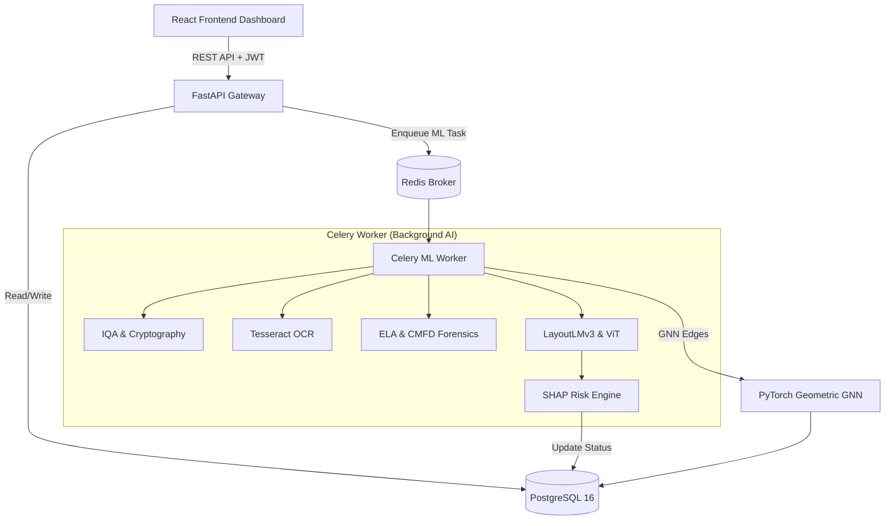

<div align="center">
  <h1>🛡️ VeriTrust</h1>
  <h3>Real-Time AI Forensic Engine for Document Fraud Detection in Indian Banking</h3>
  
  <p align="center">
    
    
    
    
    
    
  </p>
</div>

<br/>

**VeriTrust** is a production-grade, end-to-end AI forensic platform purpose-built for **Canara Bank**. It automates document fraud detection in **real-time** using a massive **10-stage AI security pipeline**, Heterogeneous Graph Neural Networks (GNN) for fraud ring detection, and Explainable AI (SHAP) to provide human-readable risk assessments.

---

## 📑 Table of Contents
1. [🎯 Problem Statement](#-problem-statement)
2. [💡 Our Solution & Business Impact](#-our-solution--business-impact)
3. [🏗️ System Architecture](#️-system-architecture)
4. [🔬 Core AI Innovations](#-core-ai-innovations)
5. [🚀 Getting Started](#-getting-started)
6. [🧪 Judging Guide (How to Test)](#-judging-guide-how-to-test)
7. [🛠️ Technical Deep Dive](#️-technical-deep-dive)

---

## 🎯 Problem Statement

Document fraud is the single largest enabler of financial crime in Indian banking. According to RBI data, Indian banks reported **₹65,017 crore** in fraud losses in FY2023–24. A significant share of this is attributed to forged identity documents (Aadhaar, PAN, GSTIN) used during KYC onboarding, loan applications, and account openings. 

Current verification systems rely heavily on manual review by bank employees — a process that is slow (2–5 days), subjective, error-prone, and fundamentally unscalable. Modern forgeries use AI-generated documents, pixel-level manipulation, metadata scrubbing, and tampered digital signatures which are virtually invisible to the human eye.

---

## 💡 Our Solution & Business Impact

**VeriTrust** replaces the manual verification bottleneck with an asynchronous AI pipeline that processes documents in **under 10 seconds**. Instead of replacing the human analyst, VeriTrust empowers them. Every AI decision is fully explainable in plain English using **SHAP (SHapley Additive exPlanations)**, ensuring RBI compliance and clear audit trails.

### 🏆 Why VeriTrust is a Tier-1 Solution
- **Offline-First AI**: Models (LayoutLMv3, ViT) run locally via ONNX/PyTorch. Zero dependency on external APIs ensures strict data privacy for PII.
- **Asynchronous Processing**: Heavy ML workloads are offloaded to **Celery** background workers, ensuring the FastAPI server never blocks.
- **Cryptographic Proofs**: Mathematical validation of UIDAI Secure QR codes and embedded PKCS#7 digital signatures.
- **Network-Level Security**: GNNs catch organized fraud rings that traditional 1-to-1 document checks completely miss.

---

## 🏗️ System Architecture



---

## 🔬 Core AI Innovations

### 1. The 10-Stage AI Security Pipeline
Every document uploaded to VeriTrust passes through sequential and parallel analysis stages:

1. **Digital Signature Verification (`PyHanko`)**: Cryptographically validates signatures in government e-PDFs. A mismatch is a mathematical proof of tampering.
2. **Image Quality Assessment (`OpenCV`)**: Rejects blurry or glare-affected uploads *before* running expensive AI models.
3. **OCR Text Extraction (`Tesseract v5`)**: Extracts text (eng+hin+mar) with per-line bounding boxes and DPI upscaling.
4. **Secure QR Cryptography (`OpenCV` + `zlib`)**: Decodes Aadhaar Secure QR codes and cross-validates the embedded name against OCR text.
5. **Error Level Analysis (`PIL` + `NumPy`)**: Detects pixel splicing by computing JPEG compression differences, generating a JET colormap heatmap.
6. **EXIF Metadata Forensics**: Scans hidden metadata for manipulation software signatures (Photoshop, Canva, etc.).
7. **Copy-Move Forgery Detection (`OpenCV` ORB)**: Detects cloned pixels using 1000 ORB keypoints.
8. **LayoutLMv3 Multimodal AI (`Transformers`)**: Fine-tuned transformer that jointly understands text *and* spatial geometry.
9. **Vision Transformer (`ViT-Base`)**: Extracts 768-dimensional embeddings to predict forgery probabilities from purely visual anomalies.
10. **SHAP Explainable AI (`scikit-learn` + `SHAP`)**: Aggregates all signals into a unified risk score with plain-English explanations.

### 2. Fraud Ring Detection (GNN)
VeriTrust detects **organized fraud rings** using a **Heterogeneous Graph Neural Network (HeteroGNN)** built with `PyTorch Geometric`.
- **11 Node Types**: User, Document, Device, IP, Mobile, Email Domain, PAN, Aadhaar, Text Entity.
- **GraphSAGE Convolutions**: Allows inductive risk propagation. If User A uploads a forged document, risk automatically propagates to User B if they share the same Device ID.

---

## 🚀 Getting Started

**Prerequisites:** Docker Desktop installed, Git, and **8GB+ RAM** available. Ports `5173`, `8000`, `5433`, and `6379` must be free.

### 1. Clone & Configure
```bash
git clone https://github.com/PurvaRane/ProjectAbhedya.git
cd ProjectAbhedya

# Setup default env variables (OTPs will print to terminal)
cp backend/.env.example backend/.env
cp frontend/.env.example frontend/.env
```

### 2. Run with Docker
```bash
docker-compose up --build
```

### 3. Run Migrations & Seed Data (New Terminal)
```bash
docker exec veritrust_backend alembic upgrade head
docker exec veritrust_backend python scripts/seed_employees.py
```

### 4. Access the Platform
- **Frontend Dashboard**: [http://localhost:5173](http://localhost:5173)
- **Backend API**: [http://localhost:8000](http://localhost:8000)

---

## 🧪 Judging Guide (How to Test)

We have pre-seeded employee accounts to evaluate the Analyst Dashboard immediately.

| Role | Email | Password |
|------|-------|----------|
| **Fraud Analyst** | analyst@veritrust.in | Analyst@12345 |

1. **Open Employee Dashboard**: Go to `http://localhost:5173/employee/login`. Login as Fraud Analyst.
2. **Register Customer**: Open an **Incognito Window** and go to `http://localhost:5173/customer/register`. Register via Email/Mobile (Check the backend terminal for the 6-digit OTP).
3. **Upload Document**: Upload an Aadhaar or PAN card image.
4. **Trigger AI Pipeline**: Switch back to the Employee Dashboard -> **Document Forensics**. Click **Verify Document (Run AI)**.
5. **Review Analysis**: Refresh to observe the final Risk Score, SHAP explanations, and the ELA manipulation heatmap.

---

## 🛠️ Technical Deep Dive

<details>
<summary><b>1. Authentication & Security Flows</b> (Click to expand)</summary>
<br/>

- **Passwords**: Hashed via `bcrypt` (Passlib).
- **Sessions**: Stateless `JWT` Access (30m) & Refresh (7d) tokens.
- **OTP**: Redis-backed Twilio SMS & Gmail SMTP OTPs with 60-second cooldowns and 5-minute expiries.
- **Rate Limiting**: `SlowAPI` enforces 60 requests/minute to prevent brute-force attacks.
- **Middleware**: Injects HSTS, CSP, X-Frame-Options, and X-XSS-Protection headers.

</details>

<details>
<summary><b>2. Database Schema</b> (Click to expand)</summary>
<br/>

- `users`: Customer profiles (Email, Mobile, PAN, Aadhaar, password hash, Face Embedding).
- `employee_accounts`: Pre-seeded Bank Staff.
- `documents`: Upload metadata and real-time processing status.
- `document_analyses`: Stores OCR text, ViT embeddings, SHAP features, and final Risk Score.
- `otp_verifications`: Temporary storage for SMS/Email validation.

</details>

<details>
<summary><b>3. Troubleshooting</b> (Click to expand)</summary>
<br/>

- **Port 5432 / 5173 / 8000 already in use**: Run `docker-compose down`, kill conflicting processes, and retry.
- **Frontend changes not reflecting**: Vite polling is active. Press `Ctrl+F5` for a hard refresh.
- **Email OTP fails with 535 BadCredentials**: Use a Google **App Password**, not your standard password.

</details>

---

<div align="center">
  <b>Canara Bank — VeriTrust Digital Platform</b> <br/>
  <i>Built for the Prototype Phase Hackathon.</i>
</div>
