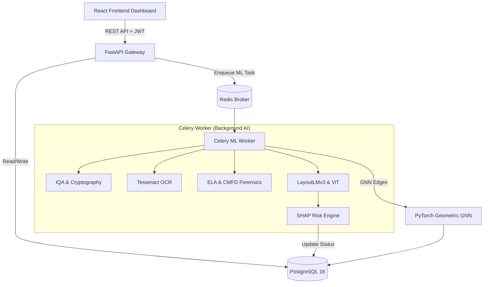

<div align="center">
  <h1>🛡️ VeriTrust</h1>
  <h3>Real-Time AI Forensic Engine for Document Fraud Detection in Indian Banking</h3>
  
  
  
  
  
  
  
  
</div>

<br/>

**VeriTrust** is a production-grade, end-to-end AI forensic platform purpose-built for **Canara Bank**. It automates document fraud detection in **real-time** using a massive **10-stage AI security pipeline**, Heterogeneous Graph Neural Networks (GNN) for fraud ring detection, and Explainable AI (SHAP) to provide human-readable risk assessments.

---

## 📑 Table of Contents
1. [🎯 Problem Statement](#-problem-statement)
2. [💡 Our Solution & Business Impact](#-our-solution--business-impact)
3. [🔬 The 10-Stage AI Security Pipeline](#-the-10-stage-ai-security-pipeline)
4. [🕸️ Fraud Ring Detection (GNN)](#️-fraud-ring-detection-gnn)
5. [🧑 Biometric & Business Validation](#-biometric--business-validation)
6. [🏗️ System Architecture](#️-system-architecture)
7. [🔐 Authentication & Security Flows](#-authentication--security-flows)
8. [🗄️ Database Schema & API](#️-database-schema--api)
9. [🚀 Getting Started (Installation)](#-getting-started-installation)
10. [⚙️ Environment Configuration](#️-environment-configuration)
11. [🧪 Complete Testing Workflow](#-complete-testing-workflow)
12. [🛠️ Troubleshooting](#️-troubleshooting)

---

## 🎯 Problem Statement

Document fraud is the single largest enabler of financial crime in Indian banking. According to RBI data, Indian banks reported **₹65,017 crore** in fraud losses in FY2023–24. A significant share of this is attributed to forged identity documents (Aadhaar, PAN, GSTIN) used during KYC onboarding, loan applications, and account openings. 

Current verification systems rely heavily on manual review by bank employees — a process that is:
- **Slow**: Takes 2–5 days per document.
- **Subjective & Error-Prone**: Human eyes cannot detect pixel-level manipulation.
- **Unscalable**: Bottlenecks digital banking adoption across India.

Modern forgeries use AI-generated documents, pixel-level copy-move manipulation, metadata scrubbing, and tampered digital signatures — techniques that are virtually invisible to the human eye.

---

## 💡 Our Solution & Business Impact

**VeriTrust** replaces the manual verification bottleneck with an asynchronous AI pipeline that processes documents in **under 10 seconds**. Instead of replacing the human analyst, VeriTrust empowers them. Every AI decision is fully explainable in plain English using **SHAP (SHapley Additive exPlanations)**, ensuring RBI compliance and clear audit trails.

### 🏆 Why VeriTrust is a Tier-1 Solution
1. **Offline-First AI**: Models (LayoutLMv3, ViT) run locally via ONNX/PyTorch. Zero dependency on external APIs ensures strict data privacy for PII.
2. **Asynchronous Processing**: Heavy ML workloads are offloaded to **Celery** background workers backed by **Redis**, ensuring the FastAPI server never blocks.
3. **Cryptographic Proofs**: Mathematical validation of UIDAI Secure QR codes and embedded PKCS#7 digital signatures.
4. **Network-Level Security**: GNNs catch organized fraud rings that traditional 1-to-1 document checks completely miss.

---

## 🔬 The 10-Stage AI Security Pipeline

Every document uploaded to VeriTrust passes through sequential and parallel analysis stages:

| Stage | Technology | What It Does |
|-------|-----------|-------------|
| **1. Digital Signature Verification** | `PyHanko` (PKCS#7) | Cryptographically validates signatures in government e-PDFs. A mismatch is a mathematical proof of tampering (instant 100% fraud score). |
| **2. Image Quality Assessment** | `OpenCV` | Rejects blurry or glare-affected uploads *before* running expensive AI models, saving GPU compute. |
| **3. OCR Text Extraction** | `Tesseract v5` | Extracts text (eng+hin+mar) with per-line bounding boxes, adaptive thresholding, and DPI upscaling. |
| **4. Secure QR Cryptography** | `OpenCV` + `zlib` | Decodes Aadhaar Secure QR codes and cross-validates the embedded name against OCR text. |
| **5. Error Level Analysis (ELA)** | `PIL` + `NumPy` | Detects pixel splicing by computing JPEG compression differences. Generates a JET colormap heatmap indicating forged regions. |
| **6. EXIF Metadata Forensics** | `PIL` EXIF Parser | Scans hidden metadata for manipulation software signatures (e.g., Photoshop, Canva, Illustrator). |
| **7. Copy-Move Forgery Detection** | `OpenCV` ORB | Detects cloned pixels using 1000 ORB keypoints and Lowe's ratio test, mapping clones to OCR bounding boxes. |
| **8. LayoutLMv3 Multimodal AI** | `Transformers` | Fine-tuned transformer that jointly understands text *and* its spatial geometry to detect tampered document templates. |
| **9. Vision Transformer (ViT)** | `ViT-Base` | Extracts 768-dimensional embeddings to predict forgery probabilities from purely visual anomalies. |
| **10. SHAP Explainable AI** | `scikit-learn` + `SHAP` | Aggregates all signals into a unified risk score. SHAP decomposes the score into plain-English explanations for the analyst. |

---

## 🕸️ Fraud Ring Detection (GNN)

Traditional systems look at documents in isolation. VeriTrust detects **organized fraud rings** using a **Heterogeneous Graph Neural Network (HeteroGNN)** built with `PyTorch Geometric`.

- **11 Node Types**: User, Document, Device, IP, Mobile, Email Domain, PAN, Aadhaar, Text Entity.
- **11 Edge Types**: `user → logs_in_from → device`, `document → similar_to → document` (ViT Cosine > 0.95), `document → conflicts_with → document` (identity contradiction).
- **GraphSAGE Convolutions**: Allows inductive risk propagation. If User A uploads a forged document, risk automatically propagates to User B if they share the same Device ID or IP address.

---

## 🧑 Biometric & Business Validation

### Facial Verification
Powered by **InsightFace (Buffalo_L)** and ONNX Runtime. Extracts 512-dimensional face embeddings for cosine similarity matching, preventing fraudsters from opening multiple accounts under different names.

### Business Logic Layer
7 deterministic rules ensure data integrity:
1. Average OCR confidence must be > 60%.
2. Mandatory field validation (Aadhaar needs Number + DOB + Gender).
3. Strict Regex enforcement for PAN (`[A-Z]{5}[0-9]{4}[A-Z]{1}`).
4. Cross-document DOB consistency checks.
5. Device fingerprinting (flags if >50 accounts share a device).

---

## 🏗️ System Architecture



---

## 🔐 Authentication & Security Flows

VeriTrust incorporates strict, enterprise-grade banking security:

- **Passwords**: Hashed via `bcrypt` (Passlib).
- **Sessions**: Stateless `JWT` Access (30m) & Refresh (7d) tokens.
- **OTP**: Redis-backed Twilio SMS & Gmail SMTP OTPs with 60-second cooldowns and 5-minute expiries.
- **Rate Limiting**: `SlowAPI` enforces 60 requests/minute to prevent brute-force attacks.
- **Middleware**: Injects HSTS, CSP, X-Frame-Options, and X-XSS-Protection headers.
- **File Security**: Strict 10MB limits, Path Traversal protection, and authenticated route guards for document viewing.

### Customer Registration Flow
1. Enter Mobile → OTP sent via Twilio SMS.
2. Verify OTP → Enter Full Name, PAN, Email, Password.
3. Alternative: Email-based registration with SMTP OTP.

---

## 🗄️ Database Schema & API

| Table | Purpose |
|-------|---------|
| `users` | Customer profiles (Email, Mobile, PAN, Aadhaar, password hash, Face Embedding). |
| `employee_accounts` | Pre-seeded Bank Staff (Admins, Fraud Analysts, Loan Officers). |
| `documents` | Upload metadata, path, and real-time processing status (`PENDING`, `PROCESSING`, `COMPLETED`). |
| `document_analyses` | Stores OCR text, ViT embeddings, SHAP features, and final Risk Score. |
| `otp_verifications` | Temporary storage for SMS/Email OTP validation state. |
| `employee_audit_logs` | Immutable audit trail for bank staff actions (login success/failures, document verification triggers). |

### Core API Endpoints
- **POST** `/api/auth/customer/register/mobile/send-otp` (Twilio SMS)
- **POST** `/api/auth/customer/login` (JWT Issuance)
- **POST** `/api/customer/document/upload` (Enqueues Document)
- **GET** `/api/analyst/fraud/documents` (Returns Aggregated Analytics)
- **POST** `/api/analyst/fraud/verify/{id}` (Manual AI Trigger)
- **GET** `/api/analyst/fraud/rings/analyze` (Triggers HeteroGNN)

---

## 🚀 Getting Started (Installation)

**Prerequisites:** 
- Docker Desktop installed and running.
- Git installed.
- **8GB+ RAM** available (Transformers and PyTorch require significant memory).
- Ports `5173`, `8000`, `5433`, and `6379` free.

### 1. Clone the Repository
```bash
git clone https://github.com/PurvaRane/ProjectAbhedya.git
cd ProjectAbhedya
```

### 2. Configure Environment Variables
```bash
# Backend
cp backend/.env.example backend/.env

# Frontend
cp frontend/.env.example frontend/.env
```
*(See the Environment Configuration section below if you wish to configure live Twilio/SMTP. Otherwise, OTPs will print to the backend terminal for easy testing).*

### 3. Start All Services via Docker
```bash
docker-compose up --build
```
This spawns 5 containers: `postgres`, `redis`, `backend` (FastAPI), `celery_worker`, and `frontend` (Vite).

### 4. Run Migrations & Seed Data
In a **new terminal window**, run:
```bash
docker exec veritrust_backend alembic upgrade head
docker exec veritrust_backend python scripts/seed_employees.py
```

### 5. Access the Platform
- **Frontend Dashboard**: [http://localhost:5173](http://localhost:5173)
- **Backend API**: [http://localhost:8000](http://localhost:8000)
- **Swagger Documentation**: [http://localhost:8000/api/docs](http://localhost:8000/api/docs)

---

## ⚙️ Environment Configuration

### Backend (`backend/.env`)
| Variable | Purpose |
|----------|---------|
| `DATABASE_URL` | PostgreSQL connection string. |
| `REDIS_URL` | Redis broker and cache string. |
| `JWT_SECRET_KEY` | High-entropy secret for signing tokens. |
| `TWILIO_ACCOUNT_SID` | *(Optional)* Twilio Account SID for Live SMS. |
| `TWILIO_AUTH_TOKEN` | *(Optional)* Twilio Auth Token. |
| `TWILIO_PHONE_NUMBER` | *(Optional)* E.164 formatted Twilio sender number. |
| `SMTP_USER` | *(Optional)* Gmail address for OTPs. |
| `SMTP_PASSWORD` | *(Optional)* Gmail 16-character App Password. |

*If Twilio/SMTP are left blank, VeriTrust falls back to `[OFFLINE SIMULATION]` mode and prints OTPs directly to the terminal logs.*

---

## 🧪 Complete Testing Workflow

We have pre-seeded employee accounts to evaluate the Analyst Dashboard immediately.

| Role | Email | Password |
|------|-------|----------|
| **Administrator** | admin@veritrust.in | Admin@12345 |
| **Fraud Analyst** | analyst@veritrust.in | Analyst@12345 |
| **Loan Officer** | officer@veritrust.in | Officer@12345 |

### Step-by-Step Judging Guide:
1. **Open Employee Dashboard**: Go to `http://localhost:5173/employee/login`. Login as Fraud Analyst. *(Note: Behavioral/Face auth is bypassed in demo mode)*.
2. **Open Customer Portal**: Open an **Incognito/Private Window** and go to `http://localhost:5173/customer/register`.
3. **Register Customer**: Complete email or mobile registration. (Check the backend terminal output for the 6-digit OTP code).
4. **Upload Document**: Upload a test document (e.g., an Aadhaar or PAN card image).
5. **Trigger AI Pipeline**: Switch back to the Employee Dashboard. Go to **Document Forensics**. You will see the document listed as `PENDING`. Click **Verify Document (Run AI)**.
6. **Watch the Background Worker**: In your terminal running `docker-compose`, watch the `celery_worker` logs. You will see models loading, ELA generation, and ViT extraction happening asynchronously.
7. **Review Explainable AI**: Refresh the Employee dashboard. Observe the final Risk Score, the SHAP plain-English explanations, and the generated ELA manipulation heatmap.
8. **Analyze Graph Rings**: Navigate to **Fraud Rings (GNN)** and click **Analyze Fraud Rings** to view cross-user correlations.

---

## 🛠️ Troubleshooting

| Problem | Cause & Solution |
|---------|------------------|
| `dockerDesktopLinuxEngine pipe error` | Docker daemon is not running. Start Docker Desktop first. |
| Frontend changes not reflecting | Vite polling is active. Press `Ctrl+F5` for a hard refresh. |
| Database Migration Errors | Ensure `docker-compose up` is fully running before executing `alembic upgrade head`. |
| Port 5432 / 5173 / 8000 already in use | Run `docker-compose down`, kill conflicting processes, and retry. |
| Email OTP fails with `535 BadCredentials` | You used your standard Gmail password. You must generate a Google **App Password**. |
| SMS OTP fails | Ensure the recipient number is verified on your Twilio Trial account, and Geo-permissions for India are enabled. |
| AI Models not loading | Ensure the machine has sufficient RAM. If running natively without Docker, ensure `/backend/models/` contains the necessary HuggingFace weights or fallback logic is triggered. |

---

## 🧑‍💻 Local Development (Without Full Docker)

If you prefer to run services natively for faster Hot Module Replacement (HMR):

1. **Start Infrastructure**:
   ```bash
   docker-compose up postgres redis -d
   ```
2. **Start Backend**:
   ```bash
   cd backend
   python -m venv venv
   source venv/bin/activate
   pip install -r requirements.txt
   alembic upgrade head
   python scripts/seed_employees.py
   uvicorn app.main:app --reload --port 8000
   ```
3. **Start Celery Worker**:
   ```bash
   cd backend
   source venv/bin/activate
   celery -A app.worker.celery_app worker --loglevel=info
   ```
4. **Start Frontend**:
   ```bash
   cd frontend
   npm install
   npm run dev
   ```

---

<div align="center">
  <b>Canara Bank — VeriTrust Digital Platform</b> <br/>
  <i>Built for the Prototype Phase Hackathon.</i>
</div>
